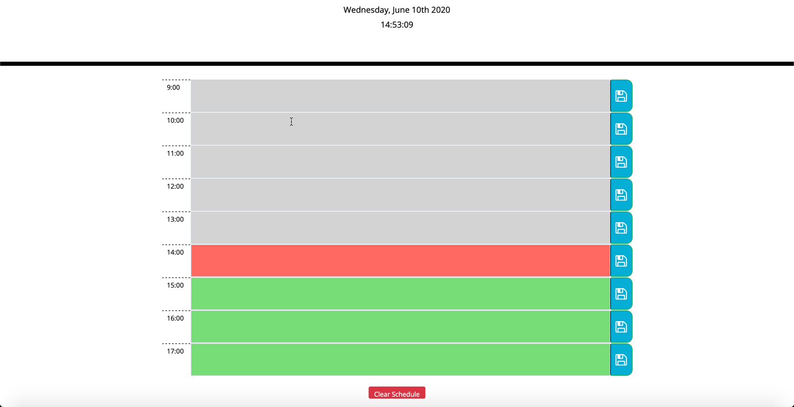

# work-day-scheduler

```
Organise your workday with this scheduler
```



Plan your day --> [Work Day Scheduler](https://darren-behan.github.io/work-day-scheduler/)

## About

```
Enter a note in the text area in each hour.
As each hour passes, the text area will grey out.
The current hour is represented by the color red filling the text area.
Future hours are represented by the color green filling the text area.
Click the 'Clear Schedule' button to clear the scheduler to start planning your day
```

## Acceptance Criteria

```
GIVEN I am using a daily planner to create a schedule
WHEN I open the planner
THEN the current day is displayed at the top of the calendar
WHEN I scroll down
THEN I am presented with timeblocks for standard business hours
WHEN I view the timeblocks for that day
THEN each timeblock is color coded to indicate whether it is in the past, present, or future
WHEN I click into a timeblock
THEN I can enter an event
WHEN I click the save button for that timeblock
THEN the text for that event is saved in local storage
WHEN I refresh the page
THEN the saved events persist
```

```
This app is powered by Bootstrap, Javascript, jQuery & moment.js.
```
